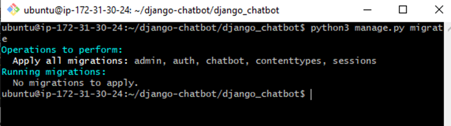

<h1>Step 1: Cloning Project</h1>

<h1>Step 2: Installing python3-pip</h1>

<h1>Step 3: Installing Django</h1>

<h1>Step 4: Installing openai</h1>

<h1>Step 5: Adding Key</h1>

<h1>Step 6: Migrating packages</h1>

<h1>Step 7: Adding Security Rule</h1>

<h1>Step 8: Allowing Host </h1>

<h1>Step 9: Running Server</h1>

<h1>Result</h1>

